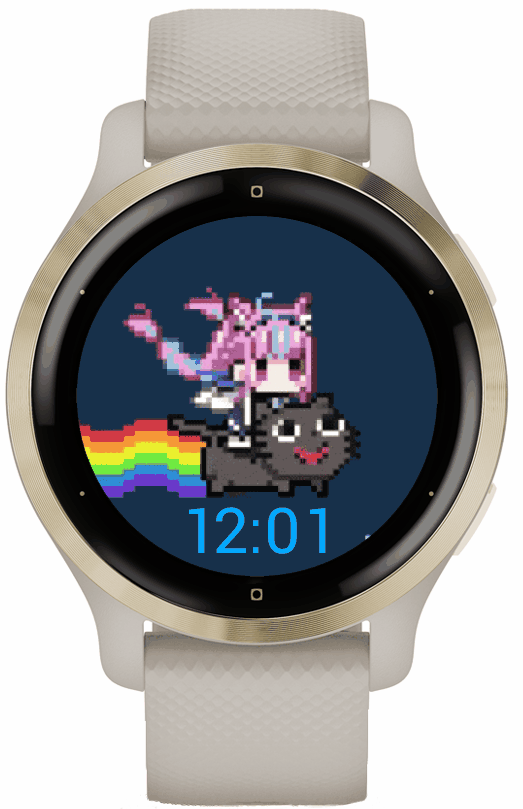

# aqua_cat_watchface

Animated GIF (that loops) for Garmin watches, packaged in a watchface.  
 Currently only has a looping image and a time field at the bottom.  
 If you're interested in changing the image or text around feel free to pull the repo, modify some stuff and build it.  
 { width=50% }  
To do:

- Steps
- Battery

  To install, just move the non-test PRG file into GARMIN/GARMIN/APPS when plugging your watch into your computer.  
  Sorry but I'll clean up the other files some day haha

---

Garmin Documentation used:  
https://developer.garmin.com/connect-iq/api-docs/index.html  
API version 4.1.x

Some interesting notes to keep track of as I worked on this:

Device context (dc) is no longer part of the constructor/initializer/other functions? like in previous API versions.  
Most methods signatures (if using parent classes like View, Layer) have 0 params and would require that you create  
other methods to set state/data explicitly (thru setters/getters).

Windows simulator path for unit testing: `~/AppData/Roaming/Garmin/ConnectIQ/Sdks/(your-sdk-version-)/bin`  
For some reason my simulator needs to be restarted before every test - could be important.

Monkey Motion is required to convert mp4/gif file formats for Garmin.
